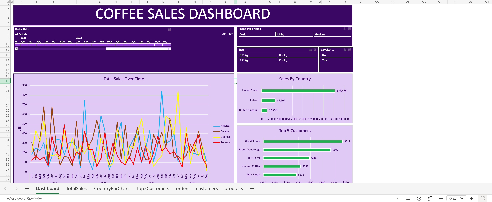

# 📊 Coffee Sales Dashboard – Advanced Excel Analytics Project

To simulate a real-world business scenario by analyzing coffee sales data and building an end-to-end **Excel** dashboard capable of supporting strategic decisions for sales and marketing.
---

## 📁 Dataset Overview

The project uses three primary datasets:

1. Orders Dataset
Contains order dates, product IDs, customer IDs, quantities, and sales figures.

2. Customers Dataset
Includes the demographic and geographic information of each customer.

3. Products Dataset
Lists product types, unit prices, cost prices, and profit margins.

These datasets required consolidation, validation, and transformation before analysis.

---

## 🛠 Data Cleaning & Processing

Performed extensive preprocessing, including:

1. Removed duplicate entries and corrected inconsistent text fields.

2. Standardized date formats using Excel date functions.

3. Merged datasets using XLOOKUP and INDEX-MATCH formulas.

Added computed fields for:

1. Total sales

2. Profit per unit

3. Coffee type categorization

Ensured clean table formatting using Excel Tables and structured references.
---

## 📊 Dashboard Creation

Designed an interactive dashboard with a clean purple theme to deliver actionable insights. Key components include:

1. Total Sales Over Time (line chart)

2. Sales by Country (horizontal bar chart)

3. Top 5 Customers by revenue (bar chart)

4. Monthly performance of coffee types (line chart)

5. KPI cards highlighting total orders, units sold, and revenue

6. Interactive slicers: Year, Month, Coffee Type

Dashboard is fully interactive and auto-refreshes when underlying PivotTables update.

---

## Dashboard : 

---

## ✅ Insights from the Coffee Sales Analysis

1. **Sales Performance Trends**

a. Sales show consistent fluctuations month-to-month, indicating seasonal buying behavior.

b. Peak order volumes appear during the early and late months of the year, while mid-year months show comparatively lower activity.

c. Despite fluctuations, overall sales remain stable, suggesting a loyal and recurring customer base.

---

2. **Product Insights**

a. Arabica consistently leads in sales across months, making it the highest-performing coffee type.

b. Robusta shows strong, steady sales but with slightly lower volume compared to Arabica.

c. Liberica has the lowest demand, indicating a niche customer segment or limited market preference.

d. Profit margins vary by product type, with premium variants generating higher per-unit profitability.

---

3. **Customer Insights**

a. A small group of customers contributes disproportionately to revenue, indicating a Pareto pattern (20% customers driving majority of sales).

b. The top customers are consistent high-value buyers, suggesting strong brand loyalty and stable repeat orders.

c. Customer distribution shows a mix of business and individual buyers, each with different purchase frequencies and order sizes.

---

4. **Geography-Based Insights**

a. United States generates the highest sales, followed by the United Kingdom and Ireland, respectively.

b UK and Ireland markets, although smaller, still contribute meaningful and steady sales—showing potential for targeted marketing growth.

c. Regional buying patterns indicate that promotional campaigns could be tailored separately for each country.

---

5. **Overall Business Insights**

a. The business demonstrates strong operational consistency, supported by regular orders and repeat customers.

b. Arabica and Robusta should remain the primary focus for inventory and promotions due to strong demand.

c. Growth opportunities exist in:

  Increasing Liberica awareness through targeted campaigns
    
  Expanding presence in the UK and Ireland
    
  Increasing average order value through bundles and loyalty programs

---
